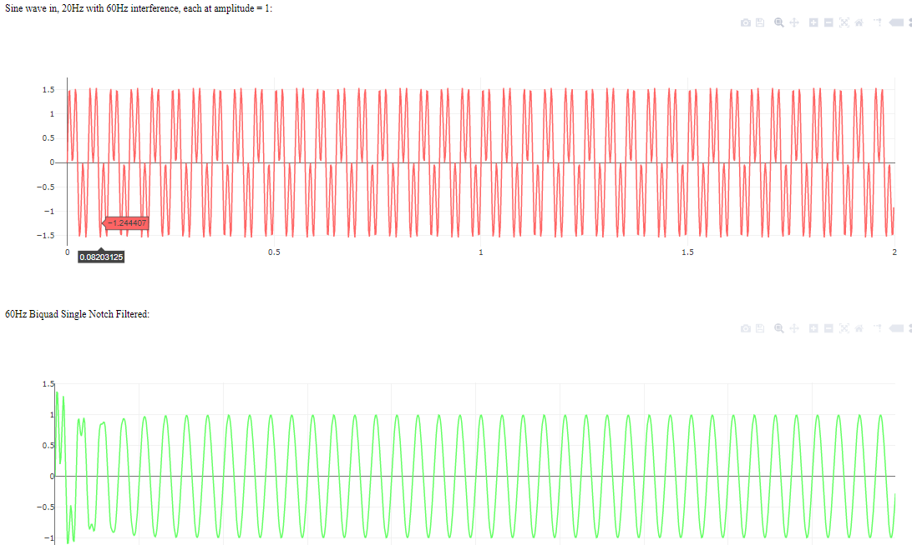

# BiquadFilters.js
A simple javascript adaptation of a set of useful Biquad filters from an obscure arachnoid.com python tutorial. See the example html for usage. I combed the internet for this and I use these for EEG signal filtering. These will work in nodejs with imports, or just paste it into your html page and delete the exports.

Features:
* Low pass
* High pass
* Band pass
* Notch
* Peak
* High shelf
* Low shelf

Set Q-factor and other parameters as needed, you will want to experiment a bit for the notch, peak, and bandpass filters, the defaults otherwise are butterworth (1/root(2)) Q factors while I set relatively effective values for the aforementioned special cases. dbGain only applies to the shelf filters, which provide amplification above or below the set frequency.

Functions:

`let classinstance = new Biquad(type,freq,sps,Q,dbGain)` Create a new filter, these keep the latest sample and filter values so make a new one for each additional filter.
types: 'lowpass','highpass','bandpass','notch','peak','lowshelf','highshelf'. Set the frequency and sample rate, with default butterworth Q values. dBGain only applies to the shelf filters. See below for notch and bandpass filter macros. I should add a peak filter macro..

`let output =  classinstance.applyFilter(signal_step)` Apply the filter to the next sample in the sequence. Returns the filtered amplitude.

`let z = classinstance.zResult(freq)` Returns the z-transfer function values (i.e. how much each frequency amplitude gets multiplied/reduced by the filter)

`let dcblocker = new class DCBlocker(r)` Create a DC blocking filter which better highlights oscillations. Default r = 0.995. Use `output = dcblocker.applyFilter(y)` for each signal step.

`makeNotchFilter(frequency,sps,bandwidth)` Macro to generate a notch filter with the correct Q factor for the specified bandwidth. Returns a Biquad class instance.

`makeBandpassFilter(freqStart,freqEnd,sps,resonance)` Macro to generate a bandpass filter. Returns a Biquad class instance. The resonance value has a default setting that works pretty well, but I recommend experimenting. Having the resonance value being around 10^floor(log10(center frequency)) works well at least at low frequencies, I used 9.75 for a 3-45Hz bandpass filter for example. Applying 4 in a row seems to work well to get much sharper cancellation, though for some reason the output gets scaled by 1/n filters so you just need to multiply by how many filters you used to restore the amplitudes to the right values. 

